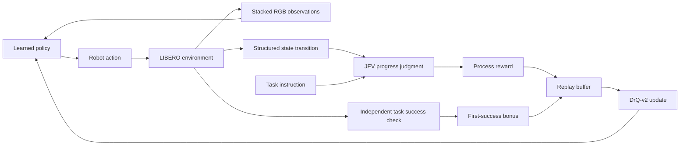

# JEV-EmbodiedReward

**JEV-based process rewards for embodied reinforcement learning.**

[简体中文](README.zh-CN.md) · [Offline diagnostics](docs/offline_diagnostics.md) · [Experiment configuration](configs/libero_spatial_task5.json)

Robotic manipulation often provides a success signal only after the task is complete. During exploration, a policy also needs feedback on whether its latest interaction moved the task forward. JEV-EmbodiedReward investigates using [TypeSafe's JEV](https://typesafe.ai/blog/introducing-system-one-models-and-jev) to turn task descriptions and structured physical state into process rewards for a learned policy.

The policy chooses and executes robot actions. JEV evaluates the resulting transitions, and those rewards enter the policy's replay buffer. Task success is checked independently by LIBERO. This separates reward evaluation, policy learning, and environment evaluation so that their behavior can be inspected individually.

This initial release contains the project description, offline comparison figures, saved curve data, and the configuration for an ongoing online experiment. Full training code and final online results are planned for a later release.

## How the online experiment works

JEV provides probabilities over a fixed set of candidate judgments. We ask whether a state transition made progress, stayed neutral, or regressed toward the instructed task. The selected class becomes a scalar learning signal; the policy itself is trained with DrQ-v2.



JEV classifies each valid transition as **progress**, **neutral**, or **regression**, mapped to **+1**, **0**, or **−1**. The current experiment adds **+200 once, at the first successful transition in an episode**. Confidence filtering is disabled. Every training episode starts from an official LIBERO initial state, using the same reset procedure as evaluation; the policy collects experience by executing its own actions from that start.

The DrQ-v2 policy observes stacked RGB images from the external and wrist cameras. Collected episodes are scored before their transitions enter replay; an episode with unresolved API errors is discarded rather than assigned substitute rewards.

JEV receives a whitelist of structured simulator physical state rather than RGB images. This is a study of state-based reward evaluation. The visual baselines below receive RGB observations, so their information access differs from JEV's.

## Offline reward diagnostics

The first comparison uses one held-out successful trajectory and one held-out failed trajectory from **LIBERO Spatial task 5**. It examines how the reward signals evolve along these two executions before using them for online learning.


*Main comparison: the curves use the diagnostic transformations documented in [Offline diagnostics](docs/offline_diagnostics.md). JEV uses structured physical state; the other methods use RGB. This single trajectory pair is a diagnostic case, rather than a benchmark-wide ranking or a policy success-rate comparison. The dashed ideal-outcome line is a visual reference, not dense ground-truth labels.*

| Method in the main comparison | Final failure / success curve value |
|---|---:|
| VIP | 0.2457 |
| RoboDopamine, NF4 | 0.3522 |
| JEV, structured state | 0.4326 |
| RoboMeter, INT8 | 0.6293 |
| S3D-prefix | 0.9783 |

These ratios summarize the final values for this pair under the **main figure's protocol**. They depend on each signal's transformation and available inputs; they do not establish an overall ordering of reward models. Numerical summaries are available in [comparison.csv](results/offline/comparison.csv).

The offline JEV diagnostic queries **11 absolute progress levels**, takes their probability-weighted expectation, and extracts positive increments above the running best progress estimate. The online experiment instead uses **three-class transition judgments (+1 / 0 / −1) plus the first-success bonus**. The two protocols answer different questions and should be interpreted separately.

<details>
<summary>Additional views: public baseline protocols and raw model outputs</summary>


*Supplementary comparison using the visual baselines' public native reward conventions and a locally declared JEV adapter on the same 16 sampled points. VIP retains its negative-cost convention. This view uses a different protocol from the main figure and its ratio table.*


*Raw outputs help distinguish a model's predictions from the transformations used to construct a reward curve. Saved native curves are available in [native_protocol_curves.npz](results/offline/native_protocol_curves.npz); protocol details are in [Offline diagnostics](docs/offline_diagnostics.md).*

</details>

<!-- ONLINE_RESULTS_START -->

## Online training: in progress

The current experiment studies whether the transition rewards help a DrQ-v2 policy learn from official task starts. Its configuration is published in [libero_spatial_task5.json](configs/libero_spatial_task5.json).

| Setting | Current experiment |
|---|---|
| Environment | LIBERO Spatial, task 5 |
| Algorithm | DrQ-v2 |
| Seed | 0 |
| Training and evaluation reset | Official LIBERO initial states |
| Episode horizon | 100 environment steps |
| Process reward | Progress +1 / neutral 0 / regression −1 |
| Success reward | +200 at the first success in each episode |
| Confidence filtering | Disabled |
| Evaluation | Every 2,000 steps, 10 episodes |
| Target training budget | 1,000,000 steps |
| Status | In progress |

A rising process-reward curve alone does not establish improved task completion. Final reporting will show process reward, total reward, and independently measured evaluation success separately.

After training completes, the planned result artifacts are `results/online/final_summary.json` and `assets/figures/training_final.png`, together with the released training implementation and reproducibility instructions. Final curves and checkpoints are not part of this initial release. A local exporter for completed runs is included; see [Online result packaging](results/online/README.md) for setup and exported fields.

<!-- ONLINE_RESULTS_END -->

## Inspect the release

The figures, CSV summary, saved arrays, and experiment configuration can be inspected without API access. The [offline report](docs/offline_diagnostics.md) describes the input modalities and reward transformations; the [README reference notes](docs/readme_reference_notes.md) record the public projects consulted for the presentation structure.

```text
assets/figures/   Offline comparison figures
configs/         Online experiment configuration
docs/            Diagnostic protocol and reference notes
results/offline/ Numerical summaries and saved curves
results/online/  Final-result packaging instructions
scripts/         Completed-run result exporter
```

## References and acknowledgements

This is an independent research project using JEV through the TypeSafe API. JEV belongs to TypeSafe; its model weights are not distributed here. The following upstream projects provide the model interfaces, learning algorithm, benchmark, or baseline implementations relevant to these experiments:

- [TypeSafe JEV introduction](https://typesafe.ai/blog/introducing-system-one-models-and-jev) and [official Python SDK](https://github.com/typesafe-ai/typesafe-sdk-python).
- [DrQ-v2](https://github.com/facebookresearch/drqv2).
- [LIBERO](https://github.com/Lifelong-Robot-Learning/LIBERO).
- [VIP](https://github.com/facebookresearch/vip).
- [Robo-Dopamine](https://github.com/FlagOpen/Robo-Dopamine).
- [Robometer](https://github.com/robometer/robometer).
- [S3D / MIL-NCE PyTorch implementation](https://github.com/antoine77340/S3D_HowTo100M), whose README links the [DeepMind model](https://tfhub.dev/deepmind/mil-nce/s3d/1).

Upstream code, model weights, and datasets retain their respective licenses and terms. This release does not assign a new license to third-party materials.
