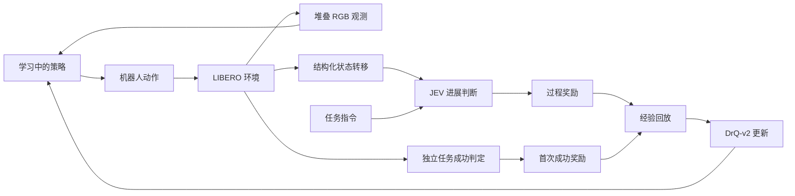
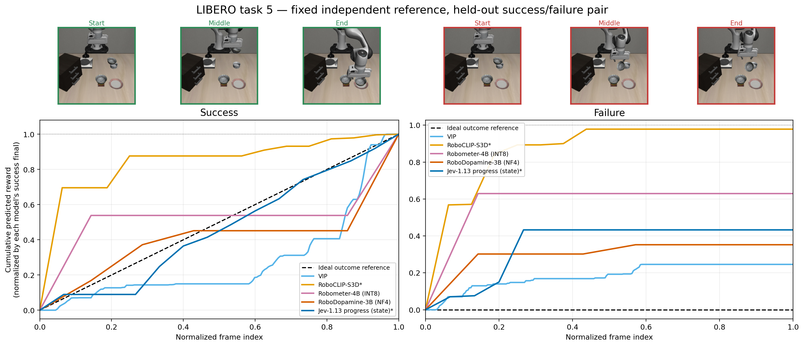
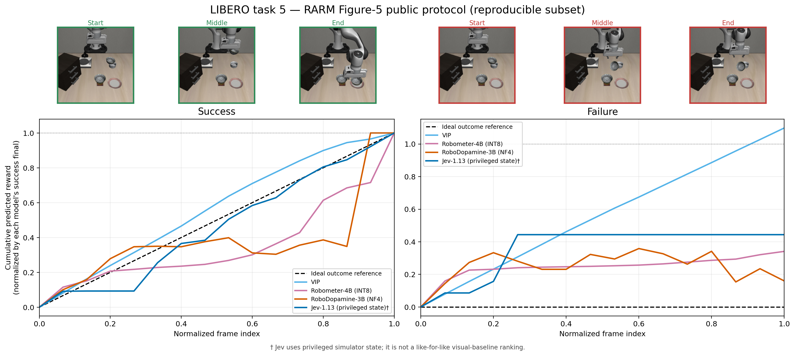
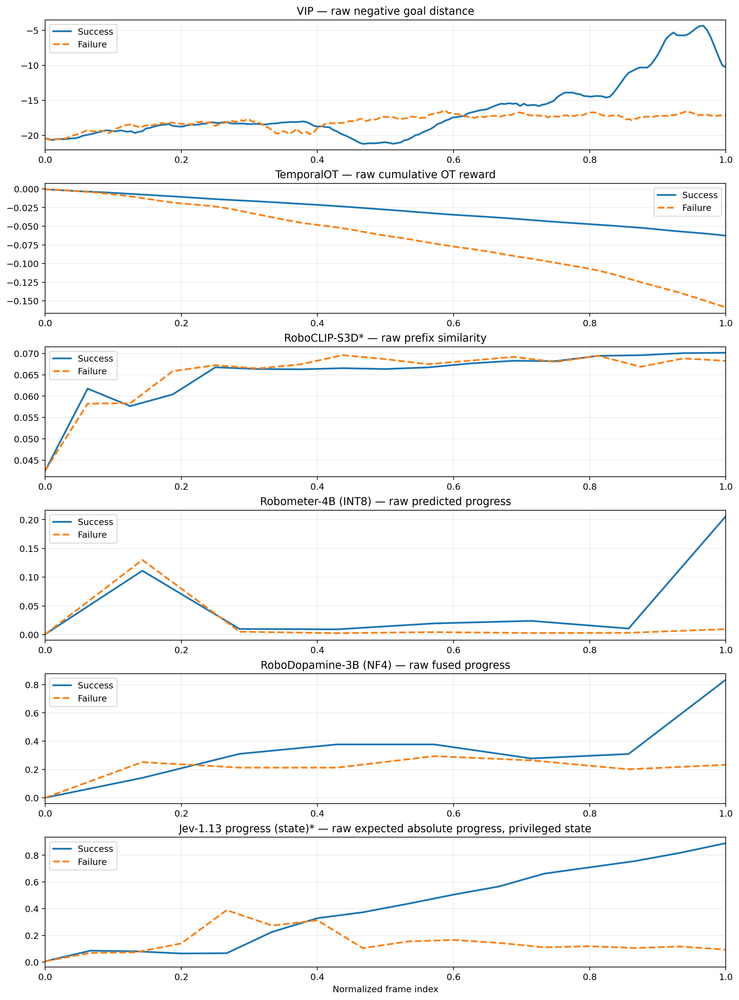

# JEV-EmbodiedReward

**将 JEV 用作具身强化学习的过程奖励评估器。**

[English](README.md) · [离线诊断说明](docs/offline_diagnostics.md) · [实验配置](configs/libero_spatial_task5.json)

机器人操作任务常常只有完成后才获得成功信号。探索过程中，策略也需要知道刚才的交互是否推动了任务进展。JEV-EmbodiedReward 研究如何使用 [TypeSafe 的 JEV](https://typesafe.ai/blog/introducing-system-one-models-and-jev)，根据任务描述和结构化物理状态，为学习中的策略提供过程奖励。

策略负责选择并执行机器人动作。JEV 评估动作产生的状态转移，奖励随后进入策略的经验回放。LIBERO 独立判断任务是否成功。奖励评估、策略学习和环境评估分别记录，便于检查各个环节的行为。

本次首发包含项目介绍、离线对比图、保存的曲线数据，以及正在进行的在线实验配置。完整训练代码和最终在线结果计划在后续版本发布。

## 在线实验如何工作

JEV 输出一组固定候选判断的概率。我们询问当前状态转移相对于任务指令是进展、中性还是退步，再将选中的类别转换为学习信号。策略本身由 DrQ-v2 训练。



JEV 将每个有效状态转移判断为**进展、中性或退步**，分别映射到 **+1、0、−1**。当前实验在**每回合首次成功的转移上额外奖励 +200**，每回合只给一次。置信度过滤关闭。训练和测试均使用 LIBERO 的正式初始状态及相同重置流程；策略从回合起点自主执行动作并采集经验。

DrQ-v2 策略观察外部相机和腕部相机的堆叠 RGB 图像。采集完回合后先评估奖励，再将转移加入经验回放；API 错误未解决的回合会被丢弃，不使用替代奖励。

JEV 接收经过白名单筛选的仿真器结构化物理状态，而非 RGB 图像。这项实验研究的是基于状态的奖励评估。下面的视觉基线使用 RGB 观测，因此它们与 JEV 获得的信息不同。

## 离线奖励诊断

首组对比使用 **LIBERO Spatial task 5** 的一条留出的成功轨迹和一条留出的失败轨迹，检查不同奖励信号如何随执行过程变化，再据此研究在线策略学习。



*主图使用[离线诊断说明](docs/offline_diagnostics.md)中记录的诊断转换。JEV 使用结构化物理状态，其余方法使用 RGB。这是一对轨迹上的诊断案例，不代表全基准排名或策略成功率对比。黑色 ideal 虚线仅为视觉参考，不是密集真值标签。*

| 主图中的方法 | 最终失败 / 成功曲线值 |
|---|---:|
| VIP | 0.2457 |
| RoboDopamine，NF4 | 0.3522 |
| JEV，结构化状态 | 0.4326 |
| RoboMeter，INT8 | 0.6293 |
| S3D-prefix | 0.9783 |

这些比值只汇总这对轨迹在**主图协议**下的终值。信号转换及输入信息会影响数值，因此不能据此给奖励模型排出总体名次。数值摘要见 [comparison.csv](results/offline/comparison.csv)。

离线 JEV 诊断查询 **11 档绝对进度**，计算概率加权期望，再提取超过历史最佳进度估计的正增量。在线实验使用的是**三类状态转移判断（+1 / 0 / −1），加首次成功奖励**。两个协议回答的问题不同，需要分别解读。

<details>
<summary>补充视图：公开基线协议与原始输出</summary>



*补充图在相同的 16 个采样点上使用视觉基线的公开原生奖励定义，以及本地声明的 JEV 奖励适配器；VIP 保留负成本定义。它与主图及主图比值表采用不同协议。*



*原始输出用于区分模型预测和构造奖励曲线时的转换。保存的原生曲线见 [native_protocol_curves.npz](results/offline/native_protocol_curves.npz)，协议详情见[离线诊断说明](docs/offline_diagnostics.md)。*

</details>

<!-- ONLINE_RESULTS_START -->

## 在线训练进行中

当前实验研究状态转移奖励能否帮助 DrQ-v2 策略从正式任务起点学习。配置已发布在 [libero_spatial_task5.json](configs/libero_spatial_task5.json)。

| 设置 | 当前实验 |
|---|---|
| 环境 | LIBERO Spatial，task 5 |
| 算法 | DrQ-v2 |
| 随机种子 | 0 |
| 训练与评估重置 | LIBERO 正式初始状态 |
| 每回合上限 | 100 个环境步 |
| 过程奖励 | 进展 +1 / 中性 0 / 退步 −1 |
| 成功奖励 | 每回合首次成功 +200 |
| 置信度过滤 | 关闭 |
| 评估 | 每 2,000 步，10 回合 |
| 目标训练预算 | 1,000,000 步 |
| 状态 | 进行中 |

过程奖励曲线上升本身不能证明任务完成能力提高。最终报告将分别展示过程奖励、总奖励，以及由环境独立测得的评估成功率。

训练完成后，计划发布 `results/online/final_summary.json`、`assets/figures/training_final.png`，以及训练实现和复现说明。最终曲线与 checkpoint 尚未包含在本次首发中。仓库附有用于已完成训练的本地导出工具，设置和导出字段见[在线结果打包说明](results/online/README.md)。

<!-- ONLINE_RESULTS_END -->

## 查看首发内容

查看图片、CSV 摘要、保存的数组和实验配置无需 API 权限。[离线说明](docs/offline_diagnostics.md)记录输入形式和奖励转换；[README 参考记录](docs/readme_reference_notes.md)说明本项目介绍结构参考了哪些公开项目。

```text
assets/figures/   离线对比图
configs/         在线实验配置
docs/            诊断协议与参考记录
results/offline/ 数值摘要和保存的曲线
results/online/  最终结果打包说明
scripts/         已完成训练的结果导出工具
```

## 参考与致谢

本项目是通过 TypeSafe API 使用 JEV 的独立研究项目。JEV 属于 TypeSafe，本仓库不分发其模型权重。以下上游项目提供了本实验涉及的模型接口、学习算法、基准环境或基线实现：

- [TypeSafe JEV 官方介绍](https://typesafe.ai/blog/introducing-system-one-models-and-jev)与[官方 Python SDK](https://github.com/typesafe-ai/typesafe-sdk-python)。
- [DrQ-v2](https://github.com/facebookresearch/drqv2)。
- [LIBERO](https://github.com/Lifelong-Robot-Learning/LIBERO)。
- [VIP](https://github.com/facebookresearch/vip)。
- [Robo-Dopamine](https://github.com/FlagOpen/Robo-Dopamine)。
- [Robometer](https://github.com/robometer/robometer)。
- [S3D / MIL-NCE 的 PyTorch 实现](https://github.com/antoine77340/S3D_HowTo100M)，其 README 链接了 [DeepMind 模型](https://tfhub.dev/deepmind/mil-nce/s3d/1)。

上游代码、模型权重和数据集各自适用原有许可与使用条款。本次首发不为第三方材料重新指定许可。
